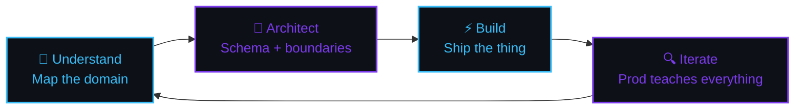
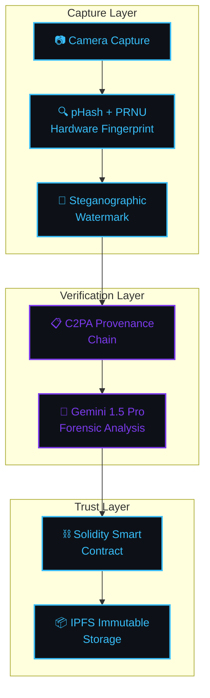
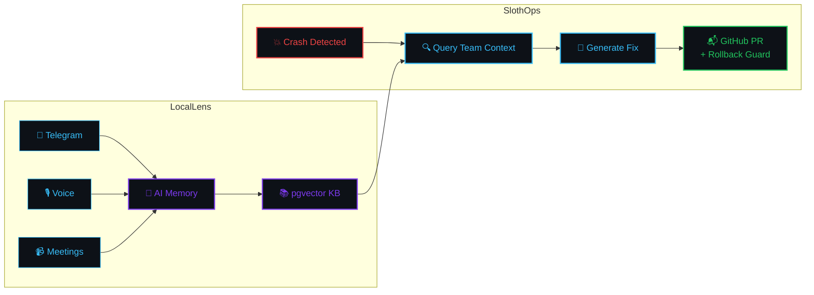
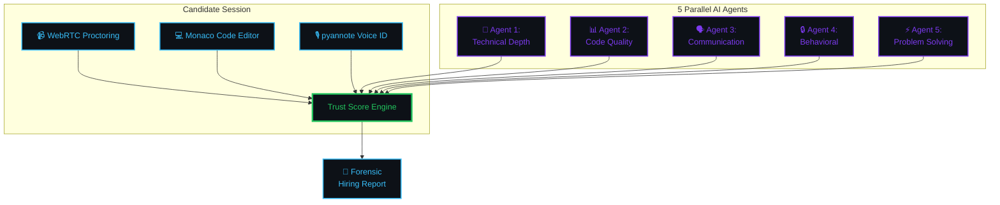
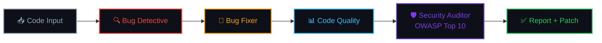

<div align="center">


<br/>

<a href="https://chksoumya.in">

</a>

<br/>

[](https://chksoumya.in)&nbsp;
[](mailto:soumya.chk101@gmail.com)&nbsp;
[](https://github.com/soumyachk101)&nbsp;
[](https://linkedin.com/in/soumyachk101)

<br/>


</div>

<br/>

<!-- ═══════════════════════════════════════════════════════════════════ -->

<table width="100%" border="0">
<tr>
<td width="55%" valign="top">

```typescript
// identity.ts — 2026

export const engineer = {
  name:     "Soumya Chakraborty",
  role:     "Full-Stack Engineer",
  base:     "West Bengal, India 🇮🇳",
  status:   "B.Tech CSE · 2nd Year",
  campus:   "NSHM Knowledge Campus, Durgapur",

  principles: [
    "you can't design what you don't understand",
    "schema mistakes compound — model data first",
    "shipped and imperfect > perfect and imaginary",
    "the best abstraction is the one you don't write",
  ],

  obsessions: [
    "distributed systems & eventual consistency",
    "media provenance & trustless verification",
    "AI-native developer tooling",
    "making complex systems feel simple",
  ],

  currentlyBuilding: "Phygital-Trace 🔗",
  openTo: [
    "meaningful open-source work",
    "real product collaborations",
    "architecture conversations",
  ],
} as const;
```

</td>
<td width="4%"></td>
<td width="41%" valign="top" align="center">

<br/>


</td>
</tr>
</table>

<br/>

<!-- ═══════════════════════════════════════════════════════════════════ -->
<!--                      MY WORKFLOW / PROCESS                        -->
<!-- ═══════════════════════════════════════════════════════════════════ -->

<div align="center">


## ⚡ &nbsp; My Workflow

</div>

<br/>



<br/>

<table width="100%" border="0">
<tr>
<td width="25%" align="center">


**`01 — Understand`**

Map domain concepts before opening the IDE.

</td>
<td width="25%" align="center">


**`02 — Architect`**

Schema & boundary mistakes compound silently.

</td>
<td width="25%" align="center">


**`03 — Ship`**

An imperfect v1 beats a perfect imaginary one.

</td>
<td width="25%" align="center">


**`04 — Own It`**

Read the source. Know *why* it works.

</td>
</tr>
</table>

<br/>

<!-- ═══════════════════════════════════════════════════════════════════ -->
<!--                         FEATURED PROJECTS                         -->
<!-- ═══════════════════════════════════════════════════════════════════ -->

<div align="center">


## 🚀 &nbsp; Featured Projects

</div>

<br/>

<!-- ── Phygital-Trace ────────────────────────────────────────────── -->

<div align="center">

### 🔗 Phygital-Trace — Camera to Blockchain Media Provenance

`media · blockchain · provenance`

</div>



<sub>`FastAPI` `Next.js` `Solidity` `IPFS` `PostgreSQL` `Gemini API`</sub>

<br/>

<!-- ── NexusOps ──────────────────────────────────────────────────── -->

<div align="center">

### ⚙️ NexusOps — AIOps Crash Resolution Platform

`aiops · sre · crash resolution`

</div>



<sub>`FastAPI` `Next.js 14` `pgvector` `Celery` `Redis` `Claude API`</sub>

<br/>

<!-- ── Neeti AI ──────────────────────────────────────────────────── -->

<div align="center">

### 🛡️ Neeti AI — Multi-Agent Interview Integrity

`interview integrity · multi-agent`

</div>



<sub>`Node/Express` `MongoDB` `Bull` `Socket.IO` `MediaPipe` `React 19`</sub>

<br/>

<!-- ── FiXr ──────────────────────────────────────────────────────── -->

<div align="center">

### 🛠️ FiXr — Multi-Agent Code Intelligence CLI

`cli · multi-agent · code intelligence`

</div>



<sub>`TypeScript` `Node.js` `Commander.js` `Groq` `Claude API`</sub>

<br/>

<!-- ═══════════════════════════════════════════════════════════════════ -->
<!--                       CURRENTLY IN THE LAB                        -->
<!-- ═══════════════════════════════════════════════════════════════════ -->

---

<br/>

<div align="center">

## 🔬 &nbsp; Currently in the Lab

</div>

<br/>

<table width="100%" border="0">
<tr>
<td align="center" width="33%" valign="top" style="border: 1px solid #1e293b; border-radius: 12px; padding: 20px;">

**Phygital-Trace**

`pHash + PRNU + steganography + C2PA + Gemini forensics`

<sub>6-part architecture upgrade</sub>

</td>
<td align="center" width="33%" valign="top" style="border: 1px solid #1e293b; border-radius: 12px; padding: 20px;">

**Local LLMs**

`Ollama + Llama 3.2 / Qwen 2.5 Coder`

<sub>Running on M5 MacBook Air bare metal</sub>

</td>
<td align="center" width="33%" valign="top" style="border: 1px solid #1e293b; border-radius: 12px; padding: 20px;">

**Claude Code Pipelines**

`PRD → TRD → Backend → DB → AI Instructions`

<sub>Docs as first-class artifacts</sub>

</td>
</tr>
</table>

<br/>

<!-- ═══════════════════════════════════════════════════════════════════ -->
<!--                          TECH STACK                               -->
<!-- ═══════════════════════════════════════════════════════════════════ -->

---

<br/>

<div align="center">

## 🧰 &nbsp; Tech Stack

</div>

<br/>

<div align="center">

<table border="0" width="94%">
<tr>
<td align="center" valign="top" width="50%">

**Languages**


<sub>TypeScript first. Python when it makes sense. C when the machine matters.</sub>

<br/><br/>

**Frontend**


<sub>Next.js 14 App Router is home base. Tailwind for velocity, Figma to think first.</sub>

</td>
<td width="4%"></td>
<td align="center" valign="top" width="46%">

**Backend & Data**


<sub>FastAPI + PostgreSQL for serious work. Redis when latency counts.</sub>

<br/><br/>

**Infrastructure**


<sub>Docker always. Railway for fast deploys. Don't fear the terminal.</sub>

</td>
</tr>
</table>

</div>

<br/>

<!-- ═══════════════════════════════════════════════════════════════════ -->
<!--                         GITHUB STATS                              -->
<!-- ═══════════════════════════════════════════════════════════════════ -->

---

<br/>

<div align="center">


## 📊 &nbsp; GitHub Stats

</div>

<br/>

<div align="center">

<!-- Streak Stats -->


<br/><br/>

<!-- Stats Card + Top Langs -->
&nbsp;


<br/><br/>

<!-- Contribution Snake -->


<br/><br/>

<!-- Activity Graph -->
[](https://github.com/ashutosh00710/github-readme-activity-graph)

</div>

<br/>


<!-- ═══════════════════════════════════════════════════════════════════ -->
<!--                          COLLABORATION                            -->
<!-- ═══════════════════════════════════════════════════════════════════ -->

---

<br/>

<div align="center">

## 🤝 &nbsp; Let's Work Together

I am particularly interested in collaborating on:

| Area | Focus |
| :--- | :--- |
| **AI Tooling** | Multi-agent systems, local LLM integrations, and developer productivity hacks. |
| **Web3 & Media** | Content provenance, decentralized identity, and blockchain-based media verification. |
| **System Design** | High-performance backends, distributed architectures, and schema-first development. |

</div>

<br/>
<!-- ═══════════════════════════════════════════════════════════════════ -->
<!--                              CTA                                  -->
<!-- ═══════════════════════════════════════════════════════════════════ -->

---

<br/>

<div align="center">


<br/>


<br/>

I work on problems at the intersection of trust, distributed systems, and media —<br/>technically hard and actually worth solving.

<br/><br/>

[](https://chksoumya.in)&nbsp;
[](mailto:soumya.chk101@gmail.com)&nbsp;
[](https://linkedin.com/in/soumyachk101)

<br/><br/>

<sub>📍 West Bengal, India &nbsp;·&nbsp; UTC+5:30</sub>

<br/>


</div>
