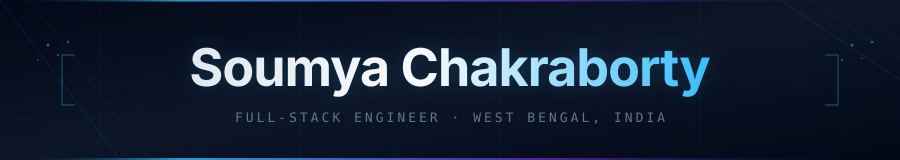

<div align="center">



</div>

<div align="center">

<a href="https://chksoumya.in">

</a>

</div>

<br/>

<div align="center">

[](https://chksoumya.in)&nbsp;
[](mailto:soumya.chk101@gmail.com)&nbsp;
[](https://github.com/soumyachk101)&nbsp;


</div>

<br/>

---

<br/>

<table width="100%" border="0">
<tr>
<td width="55%" valign="top">

```typescript
// identity.ts — 2026

export const engineer = {
  name:     "Soumya Chakraborty",
  role:     "Full-Stack Engineer",
  base:     "West Bengal, India 🇮🇳",
  status:   "B.Tech CSE · 2nd Year",

  principles: [
    "you can't design what you don't understand",
    "schema mistakes compound — model data first",
    "shipped and imperfect > perfect and imaginary",
    "the best abstraction is the one you don't write",
  ],

  obsessions: [
    "distributed systems & eventual consistency",
    "media provenance & trustless verification",
    "AI-native developer tooling",
    "making complex systems feel simple",
  ],

  currentlyBuilding: "Phygital-Trace 🔗",
  openTo: [
    "meaningful open-source work",
    "real product collaborations",
    "architecture conversations",
  ],
} as const;
```

</td>
<td width="4%"></td>
<td width="41%" valign="top" align="center">

<br/>


<br/><br/>


</td>
</tr>
</table>

<br/>

<br/>

## &nbsp; 🚀 &nbsp; Projects

<br/>

<table width="100%" border="0">
<tr>
<td width="49%" valign="top">

**🔗 Phygital-Trace**&nbsp;&nbsp;`media · blockchain · provenance`

Camera to blockchain media provenance for citizen journalism. Built to solve fake news at the capture layer, not the distribution layer.

- `pHash` + `PRNU` hardware fingerprinting at capture
- Steganographic watermarking — invisible, irremovable
- C2PA-compatible provenance chain
- Gemini 1.5 Pro forensic manipulation detection
- On-chain immutable audit trail via Solidity + IPFS

<sub>`FastAPI` `Next.js` `Solidity` `IPFS` `PostgreSQL` `Gemini API`</sub>

</td>
<td width="2%"></td>
<td width="49%" valign="top">

**⚙️ NexusOps**&nbsp;&nbsp;`aiops · sre · crash resolution`

AIOps platform that fixes crashes using team context — not just stack traces.

- **LocalLens** — AI memory from Telegram, voice, meetings → pgvector KB
- **SlothOps** — detects crash, queries team context, opens GitHub PR with fix + rollback guard

<sub>`FastAPI` `Next.js 14` `pgvector` `Celery` `Redis` `Claude API`</sub>

</td>
</tr>

<tr><td colspan="3" height="20"></td></tr>

<tr>
<td width="49%" valign="top">

**🛡️ Neeti AI**&nbsp;&nbsp;`interview integrity · multi-agent`

Five AI agents evaluating candidates in real-time. Not a proctoring tool — an integrity layer.

- WebRTC proctoring + Monaco code editor
- 5 parallel AI evaluation agents
- Proprietary Trust Score algorithm
- Forensic hiring report per candidate
- `pyannote` voice identity verification

<sub>`Node/Express` `MongoDB` `Bull` `Socket.IO` `MediaPipe` `React 19`</sub>

</td>
<td width="2%"></td>
<td width="49%" valign="top">

**🛠️ FiXr**&nbsp;&nbsp;`cli · multi-agent · code intelligence`

Terminal-first multi-agent code review — finds bugs, patches them, scores quality, audits security in one pass.

- Bug Detective → Bug Fixer → Code Quality → Security Auditor pipeline
- OWASP Top 10 aligned security scanning with `--fix` auto-patch
- Exponential backoff + rate-limit handling in the API layer
- Git pre-commit + GitHub Actions CI integration built in
- 9 languages: TS, JS, Python, Go, Java, C/C++, Rust, Ruby, PHP

<sub>`TypeScript` `Node.js` `Commander.js` `Groq` `Claude API`</sub>

</td>
</tr>
</table>

<br/>

<br/>

<div align="center">


<br/>

## 🔬 &nbsp; Currently in the Lab

<br/>

| | |
|:---|:---|
| **Phygital-Trace** 6-part arch upgrade | pHash + PRNU + steganography + C2PA + Gemini forensics |
| **Local LLMs** on bare metal | Ollama + Llama 3.2 / Qwen 2.5 Coder on M5 MacBook Air |
| **Claude Code doc pipelines** | PRD → TRD → Backend → DB → AI Instructions as first-class artifacts |

</div>

<br/>

<br/>

## 🧰 &nbsp; Stack

<br/>

<div align="center">

<table border="0" width="94%">
<tr>
<td align="center" valign="top" width="50%">

**Languages**


<sub>TypeScript first. Python when it makes sense. C when the machine matters.</sub>

<br/><br/>

**Frontend**


<sub>Next.js 14 App Router is home base. Tailwind for velocity, Figma to think first.</sub>

</td>
<td width="4%"></td>
<td align="center" valign="top" width="46%">

**Backend & Data**


<sub>FastAPI + PostgreSQL for serious work. Redis when latency counts.</sub>

<br/><br/>

**Infrastructure**


<sub>Docker always. Railway for fast deploys. Don't fear the terminal.</sub>

</td>
</tr>
</table>

</div>

<br/>

<br/>

<div align="center">


<br/>

## 🧠 &nbsp; How I Think

</div>

<br/>

<table border="0" width="100%">
<tr>
<td valign="top" width="25%" align="center">

**`01 — Understand`**

Map domain concepts before opening the IDE. That half-hour upfront saves three days of refactors.

</td>
<td valign="top" width="25%" align="center">

**`02 — Architect`**

Schema, naming, and boundary mistakes compound silently. Good architecture doesn't show off — it disappears.

</td>
<td valign="top" width="25%" align="center">

**`03 — Ship`**

Prod teaches what no local env can. An imperfect v1 beats a perfect version that only lives in your head.

</td>
<td valign="top" width="25%" align="center">

**`04 — Own It`**

Frameworks are tools. Read the source. Know why something works, not just that it does.

</td>
</tr>
</table>

<br/>

<br/>

## 🏁 &nbsp; Hackathons

<div align="center">


<br/>

| Event | |
|:---|:---|
| **HackTropica 2K26** | 36hr sprint · Asansol Engineering College |
| **Code for Change 2.0** | Social impact track · IEEE Kolkata + CNCF Durgapur · April 2026 |
| **TEKATHON 2K26** | Tech innovation track · shipped a product, not a prototype |

<sub>3 sprints &nbsp;·&nbsp; 100+ hours of constrained building &nbsp;·&nbsp; the constraint is the feature</sub>

</div>

<br/>

<br/>

## 📊 &nbsp; Stats

<br/>

<div align="center">


&nbsp;


<br/><br/>


<br/><br/>


</div>

<br/>

<br/>

<div align="center">


<br/>


<br/>

I work on problems at the intersection of trust, distributed systems, and media —<br/>technically hard and actually worth solving.

<br/><br/>

[](https://chksoumya.in)&nbsp;
[](mailto:soumya.chk101@gmail.com)

<br/><br/>

<sub>📍 West Bengal, India &nbsp;·&nbsp; UTC+5:30</sub>

<br/>


</div>
