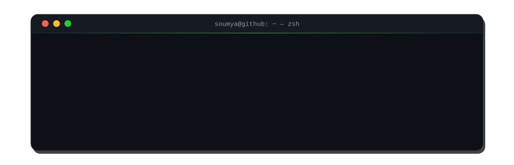

 

&nbsp;
&nbsp;

 

B.Tech CSE, 3rd year. I map the domain before opening the IDE, model the data before writing the API, and ship the imperfect v1 before it gets precious.

Mostly building tools for AI coding agents, plus security and multi-agent systems. Open to open-source collaboration, real product builds and architecture conversations.

## Projects

| Project | What it does | Stack |
|:--|:--|:--|
| [**SwarmAI**](https://github.com/soumyachk101/SwarmAI) | Local-first desktop IDE for running coding agents in parallel with shared project memory. Tasks dispatch across Git worktrees with dynamic file locks. Pheromone, the memory layer, combines BM25 and dense n-gram retrieval. | Tauri v2, Rust, React, TypeScript, SQLite |
| [**Orbit**](https://github.com/soumyachk101/Orbit-Code) [site](https://orbitcodev1.vercel.app) | Drives your coding agents (Claude Code, Codex, Cursor, Devin, Grok, Hermes, Pi, Antigravity) from a small engine on each device. Local-only by default, no account needed. Optional sync lets you follow an agent from another machine or keep it running on a VPS. | Rust |
| [**Ensembyte**](https://github.com/soumyachk101/Ensembyte) [site](https://ensembyte.vercel.app) | Open-source multi-agent coding client with two native apps. macOS runs Hydra, a lead agent that delegates to up to 8 parallel heads in isolated worktrees. Windows and Linux run on GPUI with optional CRDT sync. Local-first, zero telemetry, a diff for every turn. | Swift 6, SwiftUI, Rust, GPUI, Loro |

## Stack

## Hackathons

Seven in 2026. Joint winner at FusioniX'26, Algorand x402 track.

| When | Event | Build |
|:--|:--|:--|
| Sep 2026 | **FusioniX'26** IEM Kolkata · 36hr | **Credow.** Corporate credit allocation on Algorand. Allowances are claimed through x402 payments, and unclaimed credits earn yield in an on-chain vault. **Joint winner, x402 track.** |
| Aug 2026 | **Innofusion 3.0** Cybersecurity · 30hr | **DRISHTI.** Maps a network as a graph of real attack paths and ranks vulnerable nodes by dollar impact instead of CVSS alone. [Demo](https://lnkd.in/dY9UuKN8) |
| Jul 2026 | **Citadel Hackathon 1.0** IEM Kolkata · 30hr | Open track. |
| Apr 2026 | **Code for Change 2.0** IEEE Kolkata × CNCF Durgapur | Social impact track. |
| 2026 | **HackTropica 2K26** Asansol · 36hr | Open track. |
| 2026 | **TEKATHON 2K26** | Tech innovation track. |
| 2026 | **Tradition Hacks 2026** Miro Meetups Kolkata | |

## GitHub

&nbsp;

  

  

West Bengal, India · UTC+5:30

