<!-- Every visual here is a self-hosted animated SVG committed to this repo,
     generated by the Python scripts in scripts/. No external widget services,
     no JavaScript. Dynamic cards are refreshed on demand (see scripts/). -->



 

<code><a href="#whoami">[&nbsp;whoami&nbsp;]</a> &nbsp;·&nbsp; <a href="#projects">[&nbsp;projects&nbsp;]</a> &nbsp;·&nbsp; <a href="#hackathons">[&nbsp;hackathons&nbsp;]</a> &nbsp;·&nbsp; <a href="#leetcode">[&nbsp;leetcode&nbsp;]</a> &nbsp;·&nbsp; <a href="#contributions">[&nbsp;contributions&nbsp;]</a> &nbsp;·&nbsp; <a href="#highlights">[&nbsp;highlights&nbsp;]</a> &nbsp;·&nbsp; <a href="#languages">[&nbsp;languages&nbsp;]</a> &nbsp;·&nbsp; <a href="#contact">[&nbsp;contact&nbsp;]</a></code>

  

<h3><code>soumyachk101@github:~$ whoami</code></h3>



  

<h3><code>soumyachk101@github:~$ ls ~/projects</code></h3>

<a href="https://github.com/soumyachk101/Ensembyte"></a> <a href="https://ensembyte.vercel.app">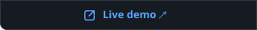</a>&nbsp;

 

<a href="https://github.com/soumyachk101/Orbit-Code"></a> &nbsp;

 

<a href="https://github.com/soumyachk101/Credow"></a> &nbsp;

 

<a href="https://github.com/soumyachk101/DrishtiNet"></a> &nbsp;

 

<a href="https://github.com/soumyachk101/SwarmAI">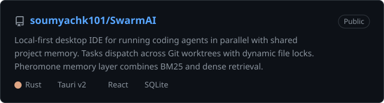</a> <a href="https://github.com/soumyachk101/SwarmAI">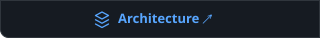</a>&nbsp;

  

<h3><code>soumyachk101@github:~$ cat hackathons.txt</code></h3>



 

<a href="https://credow.vercel.app/">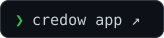</a>&nbsp;<a href="https://dhristi-demo.vercel.app">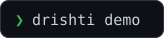</a>&nbsp;<a href="./ISRO_Hackathon_Certificate.png">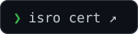</a>&nbsp;<a href="https://github.com/soumyachk101/Credow">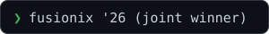</a>

  

<h3><code>soumyachk101@github:~$ ./leetcode-stats.sh</code></h3>

  

<h3><code>soumyachk101@github:~$ cat contributions.txt</code></h3>

<a href="https://github.com/soumyachk101"></a>

<a href="https://github.com/soumyachk101"></a>

  

<h3><code>soumyachk101@github:~$ cat highlights.txt</code></h3>



  

<h3><code>soumyachk101@github:~$ cat languages.txt</code></h3>



  

<h3><code>soumyachk101@github:~$ cat contact.txt</code></h3>

<a href="https://soumya.pro">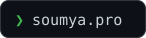</a>&nbsp;<a href="https://x.com/soumyachk1">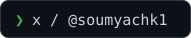</a>&nbsp;<a href="https://leetcode.com/u/soumya-chk101/">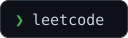</a>&nbsp;<a href="mailto:soumya.chk101@gmail.com">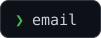</a>

  

  

