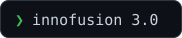
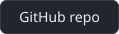

<!-- Every visual here is a self-hosted animated SVG committed to this repo,
     generated by the Python scripts in scripts/. No external widget services,
     no JavaScript. Dynamic cards are refreshed on demand (see scripts/). -->

  

<h3><code>soumyachk101@github:~$ whoami</code></h3>

 

<h3><code>soumyachk101@github:~$ ls ~/hackathons</code></h3>

&nbsp;

 

&nbsp;

 

  

<h3><code>soumyachk101@github:~$ ls ~/projects</code></h3>

 

&nbsp;

 

&nbsp;

 

&nbsp;

 

&nbsp;

  

  

<h3><code>soumyachk101@github:~$ ./leetcode-stats.sh</code></h3>

  

<h3><code>soumyachk101@github:~$ cat highlights.txt</code></h3>

  

<h3><code>soumyachk101@github:~$ cat contributions.txt</code></h3>

  

<h3><code>soumyachk101@github:~$ cat contact.txt</code></h3>

&nbsp;&nbsp;&nbsp;

  

